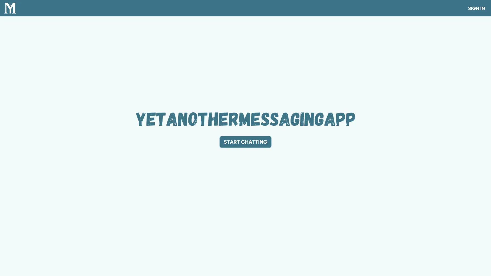
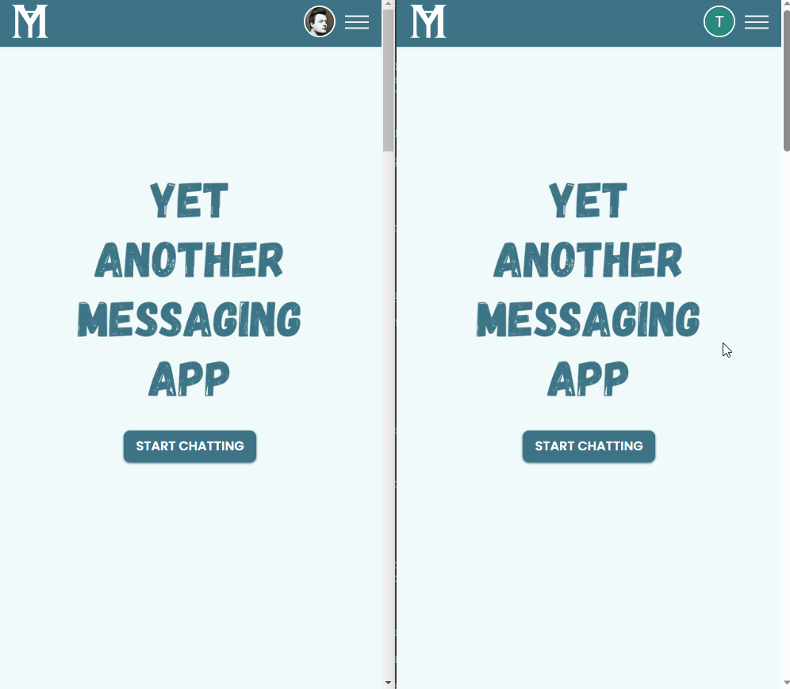

# YetAnotherMessagingApp

## Full-stack real-time messaging web app

#### [Website URL](http://yetanothermessagingapp.vercel.app/)



A full-stack real-time messaging web app where users can create their own chatroom, join an existing one with an invite string or get invited to a chatroom by the owner. Owner of the chatroom can delete all posted messages and ban any other user. Real-time chatroom events are handled by Pusher, the WebSocket solution for serverless architecture.

User authentication is handled with NextAuth and database sessions. Users can either login with Google OAuth or type in an email address and login by clicking the link sent to it.



All "major" chatroom events, such as user joining or leaving etc., have an accompanying toast notification.

### Technologies and libraries used:

Next.js, Typescript, TailwindCSS, Prisma, NextAuth, PusherJS, Tanstack Query, Zod, React-hook-form, React Toastify

## How to install

Download and install Node and NPM from https://nodejs.org/en/download.

Once downloaded, run thees commands in the terminal:

```ts
$ git clone https://github.com/mrperrytpx/robina
$ cd .\robina\
$ npm install
```

Then set the correct environment variables in `.env` following the directions in the `.env.example`.

`npm run dev` to run it in dev mode.
`npm run build` to make a production build, run the production build with `npm run start`.

## Introspection

#### `Why did you build this project?`

I built this project to teach myself how to create a serverless hosted website with real-time events handled through WebSockets. Since a WebSocket connection cannot last longer than the maximum execution time of a serverless function, which isn't sufficient, I sought to explore and address this limitation.

#### `How did you grow as a developer with this project?`

I sharpened my knowledge of Next.js, Typescript and TailwindCSS.

I learned how to set up multiple relations between tables in a Prisma schema. Additionally, I learned how to ensure that all related data is deleted when the source of it is deleted as well as how to deploy a PostgreSQL database to Vercel using Prisma migrations.

I learned how to use Pusher's service and SDK to set up multiple channels that listen to event listeners simultaneously, allowing for sending and updating data in real-time.

I learned how to dynamically import big javascript bundles to improve the website's performance.

I learned how to replicate Discord's messaging by using a queue which only sends one message request at a time.
